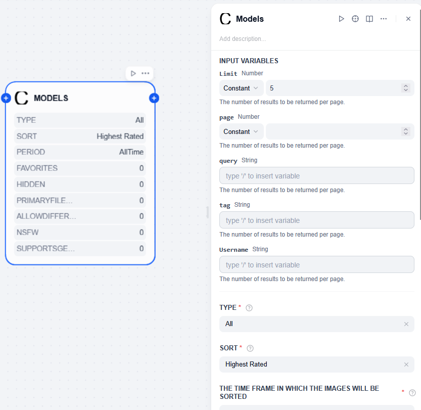
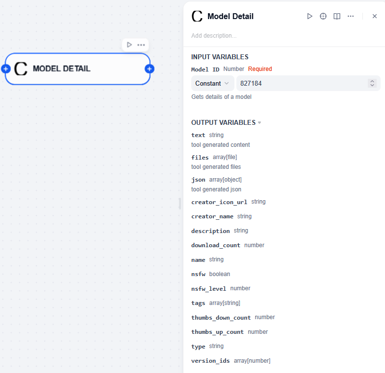

## CivitAI

**Author:** yt-koike
**Version:** 0.0.1
**Type:** tool

### Description

This is an unofficial CivitAI plugin for Dify and basically sugarcoats [CivitAI Rest API](https://developer.civitai.com/docs/api/public-rest).

### Setup

You can simply use this plugin by installing it.

### Nodes

This plugin has various nodes to use CivitAI API.
These output commonly used parameters but you can extract others from json.

## Images

Images node can fetch urls of the postes images on https://civitai.com/images

## Models

Model Details(Version) node can fetch models' names, versions and other related infos.

## Get Models by Hash
Get Models by Hash node can fetch details of a model by its hash.

## Model Details
Model Details(Version) node can fetch details of a model by its id.

## Model Details(Version)

Model Details(Version) node can fetch details about a model by its version.

## Tags

Tags node can fetch model tags.

### Required APIs and Credentials

This plugin requires the access to [CivitAI REST API](https://developer.civitai.com/docs/category/api).
CivitAI API key is optional and needed to make authorized requests.

### Reference

* Repository: https://github.com/yt-koike/dify-plugin-civitai
* Logo: Made on https://text-to-svg.com/
